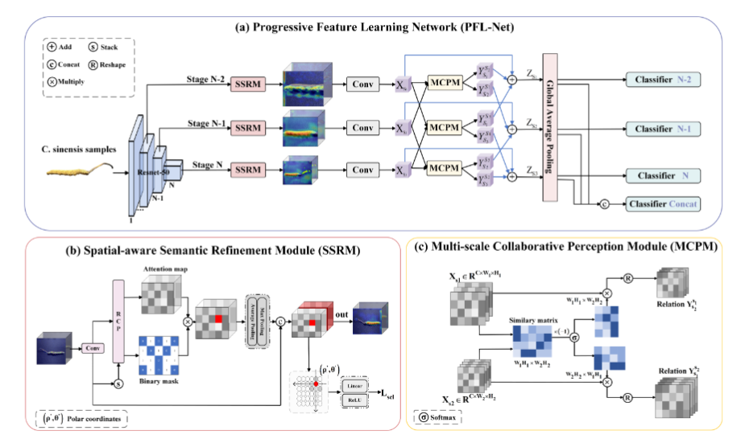

# Keen Eye: A Progressive Feature Learning Network for Cordyceps sinensis Image Recognition

PyTorch Code for  [Keen Eye: A Progressive Feature Learning Network for Cordyceps sinensis Image Recognition]()

# Requirement

python 3.9.19

torch>=2.1.1+cu121

# Dataset

| 产区       | 数量  |
| ---------- | ----- |
| 人工（假） | 3167  |
| 果洛州     | 3006  |
| 海北州     | 2476  |
| 海南州     | 2474  |
| 海西州     | 2412  |
| 黄南州     | 2962  |
| 玉树州     | 3124  |
| 总计       | 17147 |

代码即将开源
